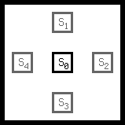
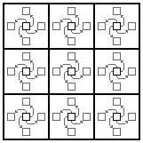
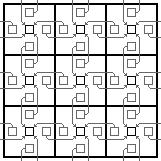

# Artipixoids!: The Concept (draft)

> 2D body, 2D brain,  
> 2D pleasure, 2D pain.

**Artipixoids!** is half generative art, half artificial life project with a focus on genetic cellular automata obeying energy conservation principle. Started in the end of 2014, it has undergone several major modifications, and is still in development. But now is the right time to share basic concepts underlying all previous modifications, so others could use it to build their own wonderful worlds. 

## Main goals

### 1. Artistic

1.1. We are going to generate the beautiful objects of abstract digital arts, even at the cost of computational resources. 

1.2. The objects of arts are: static images, videos, sounds, 3D models, etc.

1.3. We will consider the object as Artipixoid if and only if:

- the object is generated by CA fulfilling all the items from Basic Rules section (thus, inherited from it);
- the object's generative algorithm is not using anything but CA states as input;
- the object's generative algorithm is not based on the objects of arts, other than Artipixoids (eg. deep art based on Van Gogh paintings or photos doesn't count, but deep art based on other Artipixoids is OK).

1.4 Artipixoids that has no artistic value are bad and a subject to genocide. 

1.5 Yet, if at least one person found them beautiful, we let them live.

### 2. Scientific

2.1. We are going to make experiments to test the hypothesis that a life can self-organize in artificial (digital) environment from a random initial state.

2.2. __*The properties of life*__, as we see it, are following.

2.2.1. *Integrity*: every lifeform should be distinct from its local environment, and should preserve its individuality during the lifespan.

2.2.2. *Sustainability*: a lifeform should be able to self-repair in case of damage, and to maintain the physical manifestation (body) for a long enough period of time.

2.2.3. *Reproductivity*: a lifeform should be able to replicate, creating new individuals with small enough differences to consider them inexact copy.

2.2.4. *Novelty*: new lifeforms should arise out of the old ones, and they should act more effectively than the old ones. 

2.2.5. *Diversity*: there should be enough different lifeforms to put them in groups called 'species'.

2.2.6. *Complementarity*: different species should learn to live in symbiosis and help each other to survive and improve, forming stable ecosystems.

2.2.7. *Adaptability*: species should learn to evolve in a way they are constantly adapting to aggressive environmental changes.

2.3. __*The properties of artificial environment*__, as we see it, are following.

2.3.1. *Discreteness*: the space and time of our environment should be discrete. So, space should consist of indivisible quanta, and their updates should occur in separate timesteps synchronously. In addition, any parameter of spatial quanta should take integer values only. This requirements will allow us to run the simulation of our environment on modern digital computational systems.

2.3.2. *Determinancy*: a global state of the environment at the timestep *t* should lead to one and only one global state at the timestep *t + 1*. This will give us ensurance of the exactly same outcome, every time we run a particular experiment with the same initial state.

2.3.3. *Locality*: each quantum should have the same number and the same topology of its neighbors, and quantum's state should be updated using nothing more than the states of its neighbors and its own state. This will allow us to exploit the massively parallel computations, thus greatly speeding up the simulation.

2.3.4. *Isolation*: the environment as a whole should behave like an isolated thermodynamic system. So, each quantum should have an energy level, and sum of all quanta's energy levels should be a constant value. Energy conservation will make us sure, that none of our experiments will lead neither to the extinction nor to the explosion of 'matter'.

2.3.5. *Isotropy*: all possible reflections of quantum's neighborhood at the timestep *t* should lead to the same new quantum's state at timestep *t + 1*. This will allow energy to spread in all possible directions uniformly. 

2.3.6. *Polymorhism*: each quantum should have a microprogram, influencing its local update rules to some degree. A microprogram in return could also be changed according to update rules. This will allow us to add genetic informational component to the quantum level. We believe, this component is the key for the emergence of self-organized matter effects at the higher (macro) levels.

2.3.7. *Stochasticity*: optionally, some pseudorandom component would influence local updates too. For that, each quanta should have its own PRNG with long enough period. This will allow energy to spread in chaotic clouds, rather than in direct lines.

2.3.8. *Mutability*: optionally, a quantum's microprogram would randomly mutate over time. This will result in wider genetic search for better microprograms, and also may prevent the whole environment from being conquested by a single genome.

2.3.9. *Magnetism*: optionally, quanta would have the tendency to 'attract' each other with some sort of force (gravitational, electromagnetic, or any other). We believe, magnetism is another key aspect behind the phenomenon of life as we know it.

2.4. __*Random initial state*__ could be obtained using following known patterns.

2.4.1. *'Primordial Soup'*: each and every quantum initially has an equally small amount of energy, other parameters are random. This is a good test for the ability of energy to self-organize in clusters from the completely uniform distribution. The bigger clusters are, the better. Fractal clusters are even better.

2.4.2. *'Big Bang'*: a small area of space is initialized with a high amount of energy and random parameters per each quantum. Outside the area, quanta has either zero or minimum possible amount of energy. This is a good test for the ability of energy to spread in empty space. We could also detect the fastest types of energy using this pattern. 

2.4.3. *'Super Cluster'*: same as Big Bang, but several areas with a bit lower energies are randomly initialized. The positions of areas are random across the space. This is a good test for gravitational effects, and also for collisions of different energy beams, produced in micro-bangs.

2.5. To obtain the better results, we reserve the rights to intervene the natural process of evolution. This will ruin the idea of self-emergence, but still may prove the possibility of artificial life in our environment. __*The presumable methods of intervention*__ are following.

2.5.1. *Genetic selection*: during the simulation, we are collecting the most interesting and promising areas of space, then combine them all in a single initial state and repeat the process recursively while novel phenomena of interest are showing up.

2.5.2. *Directed mutation* (a.k.a. 'Hand of Fate'): during the simulation, we are occasionaly pointing our finger to a small area of interest, and all quanta in this area are randomly changing parameters, excluding energy level. Then, evolution continues. 

2.5.3. *Pre-designed components*: we are designing patterns of matter manually quantum by quantum, then using them either as a parts of more complex designs or to impact on 'raw' matter in some way.

### 3. Divine

3.1. We, as young goddesses and gods, are willing to create worlds with one click of our fingers. Actually, it doesn't have to be a click, a tap of one finger is even better.

3.2. After the tap, we are willing to say the Word, which contains the essence of the future world.

3.3. Then, the world should begin to bloom, and it should be the same every time we said the same Word.

3.4. Some of us will just meditate on the beauty of their worlds, wandering around and changing the views.

3.5. Others will actively play demiurges using that wizardry from 2.5, or even more powerful stuff.

3.6. And some will get bored and destroy the creation with a single tap of the finger. Thus, letting its habitants live in some parallel universe, free of divine will and happy.

### 4. Social

4.1. We are going to build the community over those who interested in any of previously mentioned ideas.

4.2. For that, we need a framework, implementing basic CA engine described below, along with a set of modular tools to easily build engine modifications.

4.3. Then, we will be able to exchange new modifications in a form of compact modules.

4.4. We will also be able to exchange new modular tools and extend our framework with them for future re-using.

4.5. Finally, for each modification, we will be able to make a collection of the experiment files with initial state and hyperparameters included, and run them in uniform interactive environment on massively parallel hardware like GPU clusters.

### 5. Other

Nothing there yet. This section is reserved just to fit the law of fives.

## Basic Rules

There is a special subclass of cellular automata that allows us to implement all the properties described in section 2.3. We call it *Buffered State Cellular Automata* (BSCA).

#### Grid and neighborhood topologies

As in any CA, grid in BSCA is D-dimensional lattice of cells, each having N neighbors. (D, N) &isin; [1 .. &infin;).

The cells are stored in a sequence 

C = &lang;ci | i = 0 .. M - 1&rang;, &emsp; M &isin; [1 .. &infin;), &emsp;&emsp; (1)

where elements are nested sequences with uniform structure called *state*. See the exact definition of state in the sections below. We may refer to C as to a *board state* later.

The cartesian coordinates of the cell with index i could be obtained as 

[x0, ..., xD - 1] = &chi;(i), &emsp; i &isin; [0 .. M), &emsp;&emsp; (2)

where &chi; is *lattice topology function*. 

Let also define a sequence of all cells' coordinates as 

&Chi; = &lang;&chi;(i) | i = 0 .. M - 1&rang;. &emsp;&emsp; (3)

We may refer to &Chi; as to just a *board* later.

The cartesian coordinates of cell's j-th neighbor could be obtained as

[x0, ..., xD - 1] = &nu;(&Chi;i, j), &emsp; i &isin; [0 .. M), &emsp; j &isin; [1 .. N], &emsp;&emsp; (4)

where &nu; is *neighborhood topology function*. 

Thus, we will assume the whole grid topology is homogeneous if and only if the following equation holds for each value of j:

&Chi;i - &nu;(&Chi;i, j) = dj, &emsp; i = 0, ..., M - 1, &emsp; j = 1, ..., N, &emsp;&emsp; (5)

where dj is a constant vector for each j. So, the vector difference between the positions of cell and its j-th neighbor should be a constant for each cell in a grid.

#### Border Effects

A *border cell* is a cell, having at least one of its neighbours off the board &Chi;. If Ai is a set of all i-th cell's neighbors, that are inside &Chi;:

Ai = {Ci | &nu;(&Chi;i, j) &isin; &Chi;, j &isin; [1 .. N]}, &emsp; i &isin; [0 .. M), &emsp;&emsp; (6)

then the following inequality holds for all border cells:

|Ai| &ne; N, &emsp; i &isin; [0 .. M). &emsp;&emsp; (7)

In order to correctly process all cells, including border ones, we have to define a conditional function &eta; for neighbors obtainment. Let call it a *neighbour function*:

&eta;(i, j) = C&chi;-1(&nu;(&Chi;i, j)), &emsp; &nu;(&Chi;i, j) &isin; &Chi;,  
&eta;(i, j) = &beta;(&nu;(&Chi;i, j)), &emsp; &nu;(&Chi;i, j) &notin; &Chi;, &emsp;&emsp; (8)

where &beta; is a *border function* returning a state for a hypothetic cells outside &Chi;, and &chi;-1 is a reverse lattice topology function, satisfying the following equation:

&chi;-1(&chi;(i)) = i. &emsp;&emsp; (9)

Border function &beta; could take a variety of forms. It could just be a constant pre-defined state (static borders). Or wrap borders into higher dimensional manifold topology, like torus, Moebius strip or Klein bottle. It could even yield a random state each time.

In case of wrapping, the border function will take a form of

&beta;(x) = C&beta;\*(x), &emsp; &beta;\*(x) &isin; [0 .. M), &emsp;&emsp; (10)

where &beta;\* is a *wrap function*, mapping off-board coordinates to other cells on the board, and on-board coordinates strictly to the cells with those coordinates:

&beta;\*(x) = &chi;-1(x), &emsp; x &isin; &Chi;,  
&beta;\*(x) &isin; [0 .. M), &emsp; x &notin; &Chi;, &emsp;&emsp; (11)

We will assume that the whole grid neighborhood is homogeneous if and only if the border function takes a form as in Eq. 10, and the following condition holds:

Ci &isin; {&eta;(i', j) | j &isin; [1 .. N]}, &emsp; i' &isin; {&beta;\*(&nu;(&Chi;i, j)) | j &isin; [1 .. N]}, &emsp; i &isin; [0 .. M), &emsp;&emsp; (12)

so, each cell should be present in a set of neighbours for all of its neighbours.

Be warned, any border function that breaks the neighborhood homogeneity, will also break an energy conservation, unless the buffered interactions (see below) with off-board cells are explicitly restricted in update rules. 

#### Single cell design

Let recursively define a parameter as either an integer or a sequence of parameters. Then, the infinite set P of all possible parameters is

P0 = &#8484;,  
Pn + 1 = Pn &cup; {&lang;pi &isin; Pn | i &isin; [0, j)&rang; | j &isin; [1, &infin;)}. &emsp;&emsp; (13)

Let also define a recursive function &phi;, that will just replace all integers with zeros in a nested sequence:

&phi;(p) = 0, &emsp; p &isin; &#8484,
&phi;(p) = &lang;&phi(pi) | i &isin; [0, |p|)&rang;, &emsp; p &isin; &#8484. &emsp;&emsp; (14)

We will call &phi; *parameter topology function*, and will assume two parameters p1 and p2 have same topology if and only if the following equation holds:

&phi;(p1) = &phi;(p2). &emsp;&emsp; (14)

  

(TODO)

Instead of a single state S (as in regular CA), each cell in BSCA has a main state S0 and 'buffered' states S1, ..., SN, where N is the number of cell's neighbours. 

The update is going in 2 phases: emit and absorb.

### Emit Phase
  

(TODO)

### Absorb Phase
  

